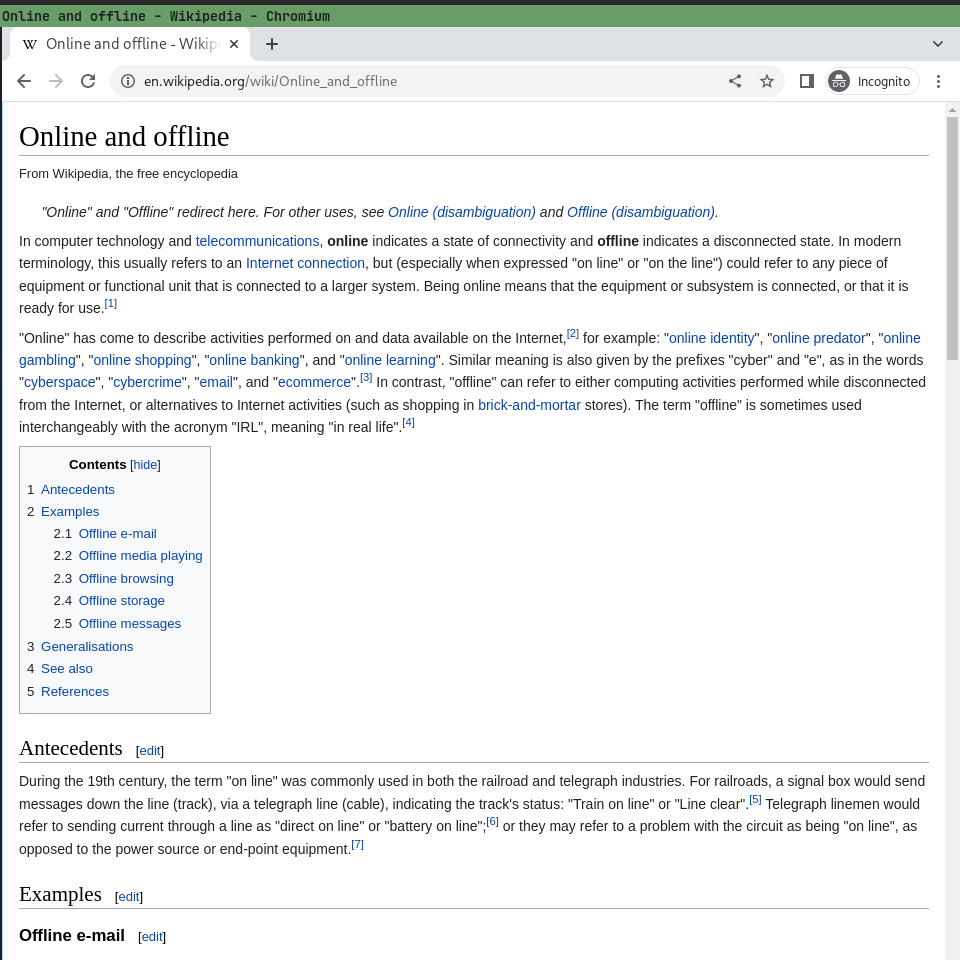
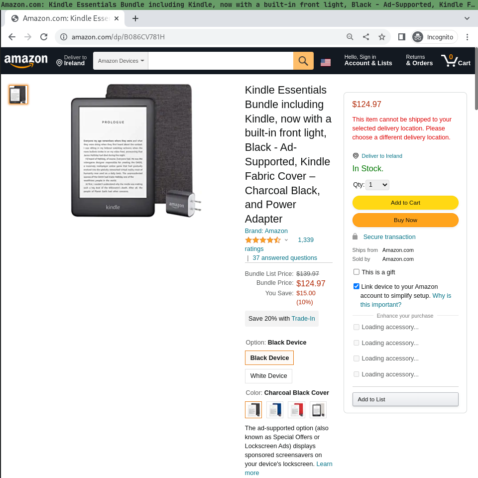

# Web-snaphots

Create "perfect" snapshots of web pages.
Take Webpage Screenshot with Python Selenium
Screenshots of webpages can be taken automatically with Python Selenium Web Driver. First load the selenium module and time module. You need the time module to wait for page loading to complete.
Then once the page is loaded, take the screenshot. This can be a PNG file or another image format. Then close the web browser, otherwise it will stay open indefinitely.


Taking Screenshots With Python
To follow along with this tutorial, you’ll need to have Python 3 installed. This tutorial uses Python v3.9.12.
All of the code used in this tutorial is available in this GitHub repository.
Setting Up the Project
Open up your terminal, navigate to a path of your choice, and run the following commands to create the project’s directory:
mkdir python-web-screenshots
cd python-web-screenshots
Create a virtual environment for the Python project by running the following command in your terminal:
python3 -m venv venv
Activate the virtual environment by running the following command in your terminal:
source venv/bin/activate
That’s it—the project directory is set up and ready to go. Next, you’ll learn to take screenshots of web pages using different Python packages.
Using Selenium
Install Selenium and a web driver manager by running the following command in your terminal:
pip install selenium webdriver-manager
Create a main.py file and add the following code to it:
# 1
from selenium import webdriver
from webdriver_manager.chrome import ChromeDriverManager
 
# 2
driver = webdriver.Chrome(ChromeDriverManager().install())
 
# 3
driver.get('https://www.urlbox.io')
 
# 4
driver.save_screenshot('screenshot.png')
 
# 5
driver.quit()
The steps in the above code do the following:
•	One: Imports the required packages. For this tutorial, you'll import the Chrome driver (ChromeDriverManager), but you can use the driver of your choice.
•	Two: Creates a driver instance (driver) for the Chrome web browser.
•	Three: Fetches (driver.get) the page specified in the URL so you can take a screenshot of it.
•	Four: Saves the fetched response as the screenshot (driver.save_screenshot).
•	Five: Closes (driver.quit) the driver and exits the program.
You can execute the Python script above by running the following command in your terminal:
python main.py
Here’s what a screenshot of a blog looks like with this method:
 
You can see that the screenshot was taken while the page was still loading—the empty space on the right side is supposed to contain a block of content. You can go to the original page to see for yourself what it should have looked like.
In addition to the possibility that the screenshot will be captured before the website is ready, you need to manually configure the width and height of the screenshot window to capture the full window. In most cases, this will result in odd scroll bars in screenshots taken with this method. Also, the cookies banner at the bottom of the page is blocking some content.
Using Selenium Headlessly
The approach above is only possible when you have access to a GUI. In some cases, like when you're using CI/CD tools, that approach won't work. To get around this limitation, you can use the headless approach to take screenshots of websites.
To do so, update the main.py file by adding the following code to it:
# 1
from selenium import webdriver
from selenium.webdriver.chrome.options import Options
from webdriver_manager.chrome import ChromeDriverManager
 
# 2
options = Options()
options.headless = True
 
# 3
driver = webdriver.Chrome(ChromeDriverManager().install(), options=options)
 
# 4
driver.get('https://www.urlbox.io')
driver.save_screenshot('screenshot.png')
 
# 5
driver.quit()
Again, looking at the code step by step, it does the following:
•	One: Imports the required packages.
•	Two: Creates an Options instance and set the headless parameter to True.
•	Three: Creates a driver instance (driver) for the Chrome Web browser.
•	Four:* Fetches (driver.get) the webpage you want to take the screenshot off of by providing its URL and save the fetched response as the screenshot (driver.save_screenshot).
•	Five: Closes (driver.quit) the driver and exits the program.
Execute the above Python script by running the following command in your terminal:
python main.py
Here’s how a screenshot of the same page from earlier looks:
 
This method automatically captured the webpage in mobile view, and doesn't do anything about the cookies banner at the bottom. However, it doesn't require spinning up a Chromium instance just for taking screenshots, and the result is better than the previous method.
Using IMGKit
IMGKit is a Python wrapper for the wkhtmltoimage utility, which is used to convert HTML to IMG using Webkit.
Install IMGKit and wkhtmltoimage by running the following commands in your terminal:
pip install imgkit
brew install wkhtmltoimage
Update the main.py file by adding the following code to it:
# 1
import imgkit
 
# 2
imgkit.from_url('https://youtube.com', 'youtube.png')
In the above code:
•	One: Imports the imgkit package.
•	Two: Downloads the specified URL, and saves the images using the from_url method from imgkit.
Execute the above Python script by running the following command in your terminal:
python main.py


## Install

``` shell
$ npm install git+https://github.com/croqaz/web-snap.git
```

## Usage

``` shell
$ web-record https://en.wikipedia.org/wiki/Online_and_offline
```

This will open a Chrome-like browser, show you the page and create an output file called by default: "snapshot_en.wikipedia.org.json"
To restore this snapshot file, you can use:

``` shell
$ web-restore snapshot_en.wikipedia.org.json
```

This will open a Chrome-like browser, show the page and you can read it even if you're offline.

You can also save and restore more complicated pages, like Amazon products:

``` shell
$ web-record https://www.amazon.com/dp/B07978J597/
$ web-restore snapshot_amazon.com.json
```

Note that some pages should be scrolled a little bit and hover some elements, to make sure all the page and images are loaded before the snapshot is taken.
This is not a limitation of web-snap, it's how modern browsers and pages are intentionally built to load resources lazily, on demand.

For a complete example, with all the flags:

``` shell
$ web-record https://en.wikipedia.org/wiki/Online_and_offline --gzip \
    --rm 'script, #mw-navigation, #mw-page-base, #mw-head-base, #footer-icons' \
    --css '#content{margin-left:0 !important}' --drop '.png$, .css$' --wait 10 \
    --js off --minify --purgeCSS
```



This will store the page just like before, but it will do a lot of pre-processing, to reduce the snapshot size from *1.3MB*, to only *27K* (48x smaller), without losing any useful information.

The `--gzip` flag will archive the JSON using GZIP. It is totally safe to use.<br>
The `--rm` flag, or `--removeElems`, will remove the specified page elements, using selectors. This can be used to remove useless elements so you can focus on the important content and reduce the snapshot size.<br>
The `--css` flag, or `--addCSS`, will add custom CSS on the page, before creating the snapshot. This can be used to change the font size, or move some elements to make the page look nicer.<br>
The `--drop`, or `--dropRequests` flag, will drop all HTTP requests matching, with regex. This can be used to stop tracking requests and reduce the final snapshot size.<br>
The `--wait` how much the browser page will stay open (in seconds) to allow the user to interact with the page, eg: accept cookies, close popups, scroll a little, hover some images.<br>
The `--js` flag will stop the browser from executing Javascript and will drop all Javascript requests, which usually reduces the snapshot size by A LOT. NOTE that this option will completely break many pages.<br>
The `--minify` flag will try to compress the final HTML as much as possible, to reduce the snapshot size. NOTE that this can crash for some pages with lots of Javascript.<br>
The `--purgeCSS` flag will purge all unused CSS and replace all styles with this processed CSS. This can reduce the snapshot size by A LOT, but will completely break some pages.

And a last example, how to capture an Amazon page:

``` shell
web-record https://www.amazon.com/dp/B086CV781H --gzip \
    --rm 'script #nav-main #mars-fs-wrapper #rhf #navFooter #navBackToTop' \
    --blockAds yes --blockList block/blocklist.txt --drop '//unagi.amazon.com/1' \
    --js off --minify --wait 10
```



These options will reduce the Amazon snapshot from ~*21MB*, to *857K* (24x smaller), without losing any useful information.

If you care about the snapshot size, you need to try different options depending on the domain, to see what works, because some options will break the page on restore.


## File format

The `snapshot.json` file format is simple:

- url - is the URL specified when creating the snapshot
- base_url - this is the resolved URL, after redirects (eg: may redirect to HTTPS and www.)
- canonical_url - (optional) this is the canonical URL of the page
- title - (optional) this is the title of the page
- html - is the final, settled HTML of the page
- responses - contains all the resources of the page (CSS, JS, images, etc) as key-value pairs:
    - body - the resource body saved as Quopri or Base64
    - headers - a limited subset of the response headers
    - request_url - the initial resource URL
    - response_url - (optional) the final response URL, after redirects (if it's different than the request URL)
    - status - a number representing the HTTP status

The format is subject to change, ideally to simplify it.


## Limitations

This format doesn't usually capture the audio and video of the page.<br>
This means you can't completely capture Youtube, Vimeo, or Spotify pages. (YET? or never?)<br>
This limitation may change in the future, but it's not the primary goal of the project.

There are also issues with some iframes and shadow DOM nodes.

Read my article that compares WARC, rrWeb and "recorded":
https://crlf.link/log/entries/220803-web-snap/


## Similar

- https://github.com/Y2Z/monolith
- https://github.com/go-shiori/obelisk
- https://github.com/danburzo/percollate
- https://github.com/croqaz/clean-mark
- https://github.com/gildas-lormeau/SingleFile
- https://github.com/sindresorhus/capture-website

Also check:

- https://crlf.link/mem/offline
- https://crlf.link/mem/web-archiving
